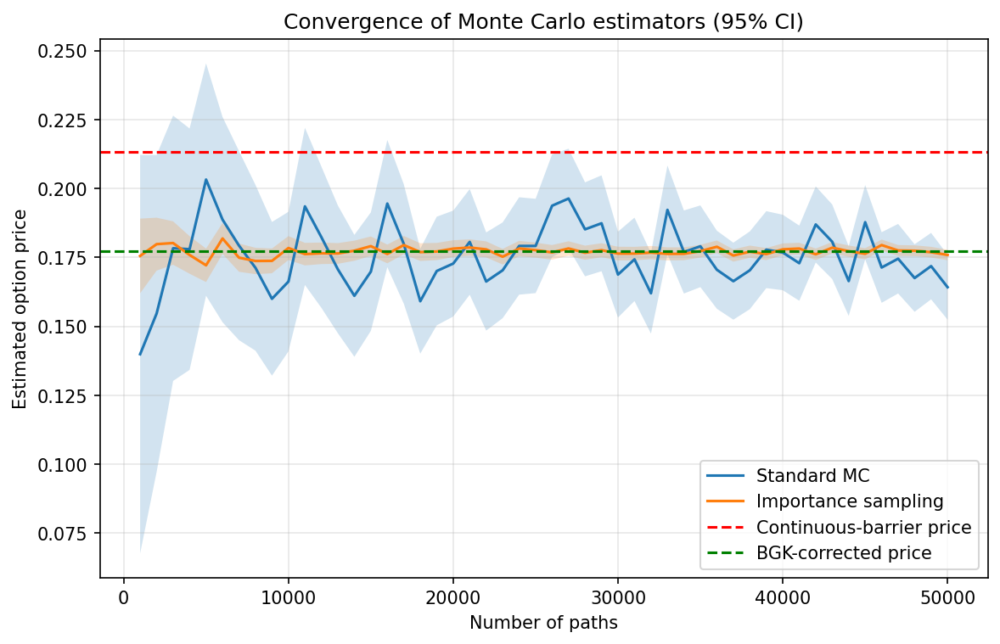

# Barrier Option Pricing with Importance Sampling


Monte Carlo pricing of a **discretely monitored up-and-in put** under Black-Scholes, with a
**two-phase drift-tilting importance sampling** scheme that cuts the standard error by ~6x
(variance by ~39x) at the same number of paths.

Course project for *Simulation (MAA313)*, MSc Financial Engineering, Mälardalen University (2026).
Full write-up: [`docs/report.pdf`](docs/report.pdf) · Slides: [`docs/presentation.pdf`](docs/presentation.pdf)

## Results

$S_0 = 100,\ K = 100,\ B_u = 120,\ r = 5\%,\ \sigma = 20\%,\ T = 1$, 252 daily monitoring dates, 50,000 paths.

| | Standard MC | Importance sampling |
|---|---|---|
| Price | 0.1693 | 0.1787 |
| Standard error | 0.00610 | **0.00098** |
| 95% CI | [0.1573, 0.1812] | [0.1768, 0.1806] |
| Knocked-in paths | 39.3% | 89.8% |

Benchmarks: continuous-barrier closed form **0.2134**, Broadie-Glasserman-Kou corrected **0.1774**.

- **SE ratio 6.2x, variance ratio ~39x**: IS reaches the same accuracy with ~1/39 of the paths.
- **Time-adjusted efficiency gain ~29x**, accounting for the slightly higher cost per IS path.
- Both estimators converge to the BGK-corrected price, not to the continuous one: with daily
  monitoring the barrier can be crossed between dates without being observed, which lowers
  the knock-in probability.



## Method

**Model.** Under the risk-neutral measure $dS_t/S_t = r\,dt + \sigma\,dW_t$. The option pays
$(K - S_T)^+$ if $S_{t_i} \ge B_u$ for some monitoring date $t_i$, and zero otherwise.

**Closed-form benchmark** (continuous monitoring, $B_u \ge K$; Rubinstein & Reiner, 1991):

$$
p = -S_0\left(\tfrac{B_u}{S_0}\right)^{2\lambda} N(-y) + K e^{-rT}\left(\tfrac{B_u}{S_0}\right)^{2\lambda-2} N\!\left(-y+\sigma\sqrt{T}\right),
\qquad \lambda = \frac{r + \sigma^2/2}{\sigma^2},\quad
y = \frac{\ln\!\left(B_u^2/(S_0K)\right)}{\sigma\sqrt{T}} + \lambda\sigma\sqrt{T}.
$$

**Discrete-monitoring correction** (Broadie, Glasserman & Kou, 1997): evaluate the formula at
$B_u e^{\beta\sigma\sqrt{T/n}}$ with $\beta = -\zeta(1/2)/\sqrt{2\pi} \approx 0.5826$.

**Importance sampling.** A positive payoff requires a joint event: hit the barrier *above*,
then finish *below* the strike. Log-increments $\Delta X \sim N(\mu, \sigma^2\Delta t)$,
$\mu = (r - \sigma^2/2)\Delta t$, are sampled with mean $\mu + \sigma^2\Delta t\,\theta$, where

$$
\theta_\pm = \tfrac12 - \tfrac{r}{\sigma^2} \pm \frac{2b + c}{T\sigma^2},\qquad b = \ln\tfrac{B_u}{S_0},\ c = \ln\tfrac{S_0}{K},
$$

using $\theta_+$ (upward tilt) up to and including the first crossing $\tau$, and $\theta_-$
(downward tilt) afterwards. Each step contributes $\exp(-\theta\,\Delta X + \psi(\theta))$ to the
likelihood ratio, with $\psi(\theta) = \mu\theta + \tfrac12\sigma^2\Delta t\,\theta^2$.
Since $\theta_\pm$ are symmetric around $\tfrac12 - r/\sigma^2$, $\psi(\theta_+) = \psi(\theta_-) =: \psi$,
and the path likelihood ratio simplifies to

$$
\log L = (\theta_- - \theta_+)\,X_\tau - \theta_-\,X_T + n\,\psi .
$$

The estimator $\hat V = \frac1m\sum_i e^{-rT}(K - S_T^{(i)})^+\,\mathbf 1_{\{\tau^{(i)} \le n\}}\,L^{(i)}$ is unbiased.

**Implementation.** Fully vectorised NumPy: the post-crossing path is reconstructed from two
cumulative sums over the same shocks (one per tilt), so no per-path Python loop is needed.
Paths are processed in batches to bound memory. A unit test checks that the vectorised
estimator matches a step-by-step loop implementation to machine precision.

## Repository structure

```
├── src/barrier_is/
│   ├── analytical.py           # closed form, vanilla put, BGK correction
│   ├── monte_carlo.py          # crude MC estimator, path simulation, result container
│   └── importance_sampling.py  # tilts and IS estimator
├── scripts/
│   ├── run_pricing.py          # results table + sample-path figure
│   └── convergence_study.py    # convergence figure
├── tests/test_pricing.py
├── figures/
└── docs/                       # report and slides (PDF)
```

## Quickstart

```bash
git clone https://github.com/USERNAME/barrier-option-importance-sampling.git
cd barrier-option-importance-sampling
python -m venv .venv && source .venv/bin/activate   # Windows: .venv\Scripts\activate
pip install -e ".[dev]"

python scripts/run_pricing.py          # ~1 s
python scripts/convergence_study.py    # ~15 s
pytest -q
```

```python
from barrier_is import price_importance_sampling

res = price_importance_sampling(S0=100, K=100, r=0.05, sigma=0.2, T=1, B=120,
                                n_steps=252, n_paths=50_000, seed=42)
print(res.price, res.std_error)
```

Results are reproducible through the `seed` argument.

## Limitations and extensions

- The tilts are a heuristic choice rather than the variance-minimising ones; an optimised
  or adaptive tilt (e.g. via cross-entropy) could improve the gain further.
- The closed-form benchmark is implemented for $B_u \ge K$ only.
- Natural extensions: other barrier types via in-out parity, Brownian-bridge crossing
  correction for continuous monitoring, stochastic volatility.

## References

- M. Rubinstein, E. Reiner, *Breaking Down the Barrier*, Risk 4(8), 1991.
- M. Broadie, P. Glasserman, S. Kou, *A Continuity Correction for Discrete Barrier Options*, Mathematical Finance 7(4), 1997.
- P. Glasserman, *Monte Carlo Methods in Financial Engineering*, Springer, 2004.
- Y. Zhu, X. Wu, I. Chern, Z. Sun, *Derivative Securities and Difference Methods*, Springer, 2nd ed., 2013.

## Author

**Paolo Nardi** — MSc Financial Engineering, Mälardalen University

## License

MIT
